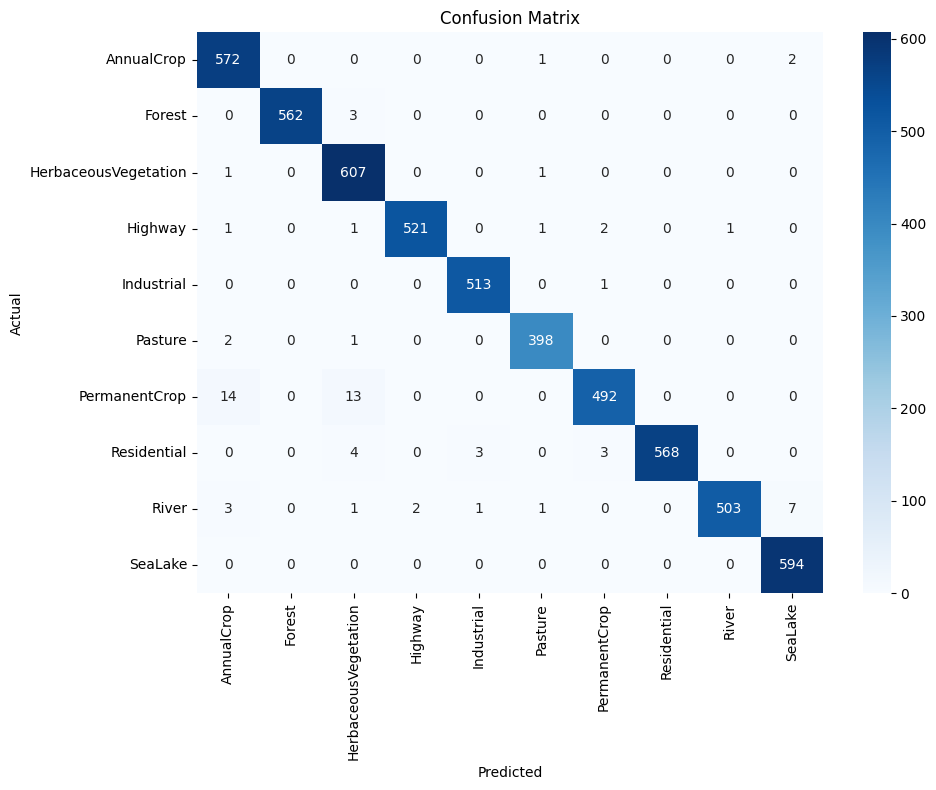
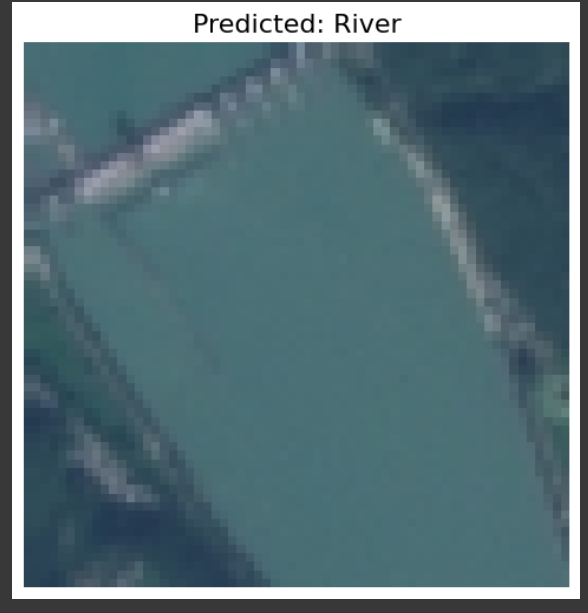
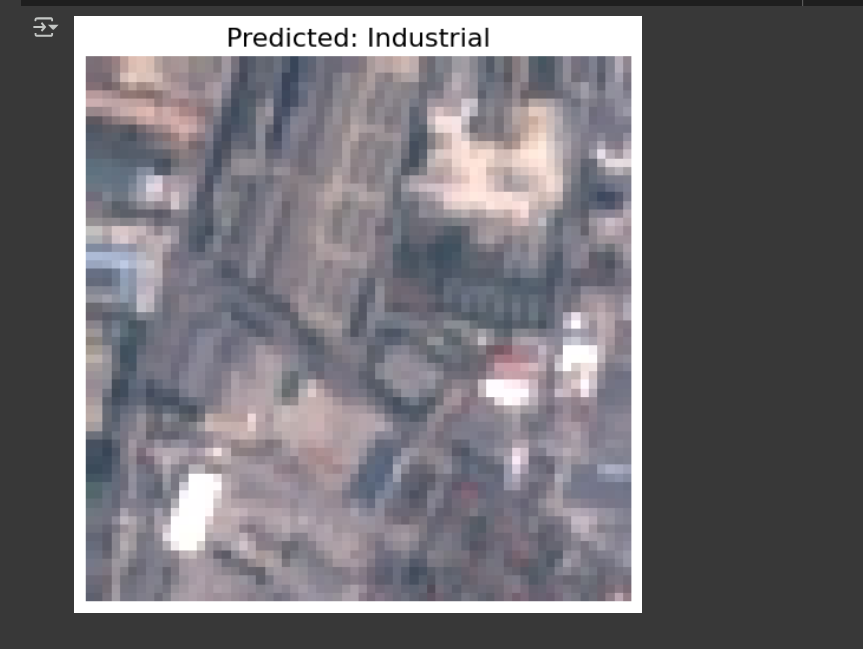
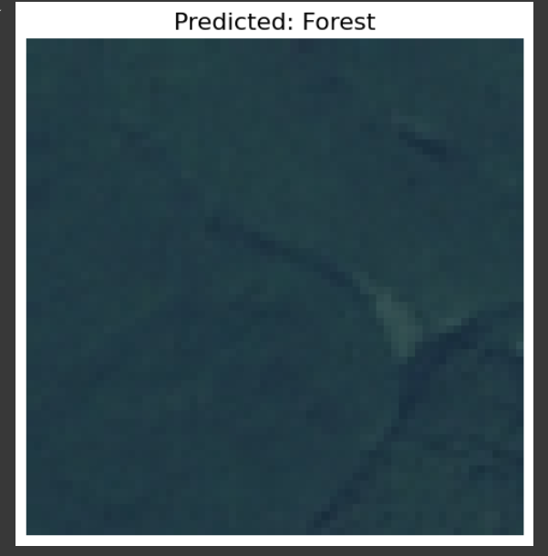

# EuroSAT Land Cover Classification

A deep learning model using ResNet-50 to classify satellite imagery from the EuroSAT dataset into 10 terrain categories.
 -  'AnnualCrop', 'Forest', 'HerbaceousVegetation', 'Highway', 'Industrial',
    'Pasture', 'PermanentCrop', 'Residential', 'River', 'SeaLake'

## Contents
- Trained Model
- Training Code
- Evaluation Report
- Sample Predictions

## Dataset
- EuroSAT RGB: https://github.com/phelber/eurosat

## Confusion Matrix

## Demo

## Future Work
- Model pruning for edge devices
- Integration with drone image feeds
- Mobile demo
- Training on further dataset to enhance the model
